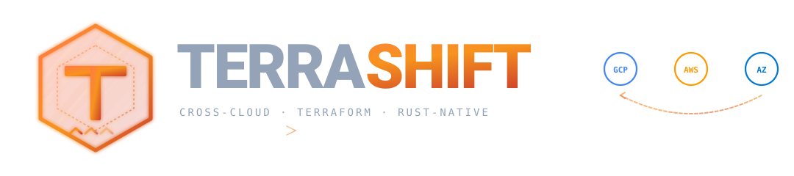

<div align="center">

<picture>
  <source media="(prefers-color-scheme: dark)" srcset="assets/logo.svg">
  <source media="(prefers-color-scheme: light)" srcset="assets/logo.svg">
  
</picture>

<br>

**Cross-cloud Terraform migration as a single Rust binary.**
Move infrastructure between **GCP**, **AWS**, and **Azure** with deterministic
code where it counts and LLMs only where they earn their place.

<br>

[](LICENSE)
[](https://www.rust-lang.org/)
[](#install)
[-F7931E?style=flat-square)](#roadmap)

</div>

---

## Why Terrashift?

Cloud migrations get stuck in two places: the LLM **hallucinates** Terraform
that won't apply, and the agent loop **runs forever** with no way to bound
cost or surface why a migration failed. Terrashift is opinionated about both.

| Approach | Trade-off |
|---|---|
| **Deterministic where possible.** Scanner, Validator, Generator, Executor are pure code. | LLMs only on the hard parts — mapping, recovery, cost optimization. |
| **Bounded agent loops.** Two-budget design (`max_iterations` × `max_turns`) on every agent. | No runaway token cost. Failure is loud, not silent. |
| **Article III gate.** No HCL is ever emitted that the Validator hasn't approved against the target-provider schema. | Catches hallucinated resource types and attribute names *before* `terraform plan`. |
| **Append-only signed audit log.** Every LLM call, tool execution, and credential resolution is recorded with an Ed25519 signature chain. | Tamper-evident; verifiable end-to-end. |
| **No Python in the production stack.** Single Rust binary, rustls, no OpenSSL, no LangChain, no LangGraph. | One artifact, fast cold start, static linking, supply chain you can audit. |

---

## Quick start

> **Note** — Terrashift is in active development (Stage 2 / MVP+). The CLI
> contract is stable for the seams below; surface area is still growing.
> See the [roadmap](#roadmap) for what's shippable today vs planned.

### Install (from source)

```bash
git clone https://github.com/MohamedGouda99/terrashift.git
cd terrashift
cargo build --release
# Single binary lands at target/release/terrashift
```

### Configure your providers

```bash
# Create a profile with your LLM + cloud provider settings.
mkdir -p ~/.terrashift
cat > ~/.terrashift/profile.toml <<'EOF'
[providers.groq]
provider_type  = "openai-compatible"
endpoint       = "https://api.groq.com/openai/v1"
api_key_env    = "GROQ_API_KEY"

[tiers]
eco   = { provider = "groq", model = "llama-3.3-70b-versatile" }
smart = { provider = "groq", model = "llama-3.3-70b-versatile" }

[cloud.aws]
region            = "us-east-1"
credentials_chain = ["env", "profile:default"]

[cloud.azure]
subscription_id   = "00000000-0000-0000-0000-000000000000"
EOF

export GROQ_API_KEY=...
```

### Run a migration

```bash
# Scan source HCL → produce a plan → validate → recover failures → apply
terrashift migrate \
  --source ./infra/aws \
  --target ./infra/azure \
  --from-provider aws \
  --to-provider azurerm
```

What happens under the hood:

1. **Scanner** parses every `.tf` file with `hcl-rs` (deterministic).
2. **Mapper** asks the LLM for the target-provider equivalent of each source resource.
3. **Validator** rejects any plan whose resources / attributes aren't in the target schema — the Article III gate.
4. **Recovery agent** asks the LLM to fix Validator-blocked plans (bounded ReAct loop, max 5 outer iterations).
5. **Cost Optimizer agent** trades right-sizing / storage class / architecture changes against an operator-set monthly cost target.
6. **Generator** emits target HCL deterministically with `.backup/` rollback files.
7. **Executor** runs `terraform plan` + `terraform apply` in a sandboxed container with shell-tool-approval policies.

---

## Architecture

```
┌─────────────┐       ┌─────────────┐       ┌─────────────┐
│   Scanner   │──────▶│   Mapper    │──────▶│  Validator  │
│  (hcl-rs)   │       │ (LLM Eco)   │       │ Article III │
│deterministic│       │             │       │    gate     │
└─────────────┘       └─────────────┘       └──────┬──────┘
                                                   │ pass / fail
                            ┌──────────────────────┴──────────────────────┐
                            ▼                                              ▼
                  ┌──────────────────┐                         ┌──────────────────┐
                  │  Recovery agent  │ (Stage 2)               │  Cost Optimizer  │ (Stage 2)
                  │  bounded ReAct   │                         │  trade-off loop  │
                  │  fix tools       │                         │ Infracost-driven │
                  └────────┬─────────┘                         └────────┬─────────┘
                           │                                            │
                           └─────────────────┬──────────────────────────┘
                                             ▼
                                      ┌─────────────┐
                                      │  Generator  │
                                      │  (hcl-rs +  │
                                      │  templates) │
                                      └──────┬──────┘
                                             ▼
                                      ┌─────────────┐
                                      │  Executor   │
                                      │ (sandboxed  │
                                      │  terraform) │
                                      └──────┬──────┘
                                             ▼
                                      ┌─────────────┐
                                      │  Verifier   │
                                      │ post-apply  │
                                      │ state diff  │
                                      └─────────────┘
```

Cross-cutting:

- **Audit log** — Ed25519-signed, SQLite-backed; hooks `before_tool_execution` and `after_tool_execution`. Every action recorded.
- **Credential broker** — resolves cloud creds via STS / WIF / managed-identity at request time only; secrets never touch disk (`Zeroizing<String>` on drop).
- **Knowledge service** — caches target-provider schemas locally with HTTP fallback to `registry.terraform.io`.
- **Agent kernel** — `libs/agent-core::run_agent` is the shared loop primitive. Recovery and Cost Optimizer ride on it.

---

## Tech stack

| Layer | Choice | Why |
|---|---|---|
| Language | Rust 1.94+ | One binary, no runtime, predictable performance |
| LLM SDK | [`stakai`](https://crates.io/crates/stakai) | Provider-agnostic; routes to OpenAI / Anthropic / Gemini / Bedrock / Groq |
| MCP | [`rmcp`](https://crates.io/crates/rmcp) | Model Context Protocol for tool routing |
| HCL | [`hcl-rs`](https://crates.io/crates/hcl-rs) | Native HCL2 parser + emitter |
| Persistence | `sqlx` + SQLite | Audit chain + schema cache |
| TLS | `rustls` | No OpenSSL — static linking |
| Vector store | [`lancedb`](https://crates.io/crates/lancedb) | Embedded, file-based, RAG (Stage 3+) |
| Sandboxing | Docker | Isolation for `terraform apply` |
| Shell-call gate | `tree-sitter-bash` | Per-command approval policy |

---

## Features

| Feature | Status | Stage |
|---|---|---|
| Single-cloud Terraform parsing + emission (AWS / GCP / Azure) | ✅ Shipped | 1 |
| LLM-powered Mapper with structured output | ✅ Shipped | 1 |
| Article III Validator gate (rejects hallucinated resources) | ✅ Shipped | 1 |
| Append-only signed audit log (Ed25519) | ✅ Shipped | 1 |
| Sandboxed Executor with shell-command approval | ✅ Structural | 1 |
| Credential broker (env / STS / `Zeroizing` memory) | ✅ Shipped | 1 |
| TUI with slash commands (`/plan`, `/migrate`, `/audit`) | ✅ Shipped | 1 |
| Eval framework + token-cost regression CI gate | ✅ Shipped | 1 |
| **Agent loop kernel** (run_agent + ApprovalStateMachine + retry) | ✅ Shipped | **2** |
| **Recovery agent** (bounded ReAct loop, fix tools) | ✅ Structural | **2** |
| **Cost Optimizer agent** (Infracost-driven trade-offs) | ✅ Structural | **2** |
| WIF / OIDC modernization (replace static keys) | 🟡 Planned | 2 |
| Detached mode + Slack/email/webhook notifications | 🟡 Planned | 2 |
| LLM tier router with provider fallback | 🟡 Planned | 3 |
| RAG-backed schema knowledge (LanceDB) | 🟡 Planned | 3 |
| 6-direction cloud-pair smoke matrix | 🟡 Planned | 3 |
| Stateful data migration (DMS / Storage Transfer / AzCopy) | 🟡 Planned | 4 |
| Strategy Selector + Cutover agents + DNS plug-ins | 🟡 Planned | 4 |
| Module ecosystem (Terragrunt, OpenTofu, community modules) | 🟡 Planned | 5 |
| SOC 2 Type 1 audit-ready posture | 🟡 Planned | 6 / GA |

---

## Roadmap

| Tier | What it means | ETA¹ |
|---|---|---|
| **MVP shippable** | Single cloud-pair (GCP→AWS), agentic recovery, deterministic Stage 1 verified end-to-end | ~10 weeks |
| **Production-grade** | Multi-cloud (GCP↔AWS↔Azure), RAG-backed knowledge, real customer reproducibility | ~18 weeks |
| **GA + SaaS** | Data migration, cutover, SOC 2 ready, optional managed control plane | ~14 months |

¹ ETAs assume a team of 4–8; solo / part-time will scale longer.

---

## Project conventions

Terrashift is built around two non-negotiables:

- **Bounded agents.** The project permits exactly three agents:
  **Recovery**, **Cost Optimizer**, and **Cutover**. Adding any other agent
  requires an RFC + stage-gate approval. We mean it.
- **Deterministic where possible.** Scanner, Validator, Generator, Executor,
  and the audit log are pure code. LLMs only handle mapping, recovery, and
  cost trade-offs.

Every PR cites the conventions it invokes, the architectural pattern it mirrors,
and any token-cost delta against the eval baseline.

---

## Documentation

- [`docs/README.md`](docs/README.md) — full docs index (governance,
  architecture, development, onboarding, reference)
- [`docs/onboarding/terrashift-mvp-onboarding.md`](docs/onboarding/terrashift-mvp-onboarding.md)
  — comprehensive deep-dive for new contributors
- [`docs/governance/CONSTITUTION.md`](docs/governance/CONSTITUTION.md) —
  the 13 articles (cite in every PR)
- [`docs/architecture/terrashift_plan.md`](docs/architecture/terrashift_plan.md)
  — the architecture document

## Contributing

Pull requests welcome — see [`CONTRIBUTING.md`](CONTRIBUTING.md) for the
local-check sequence, commit conventions, and our agent-RFC rule.

For security issues, do **not** open a public GitHub issue. Use
[GitHub Security Advisories](https://github.com/MohamedGouda99/terrashift/security/advisories/new)
— see [`SECURITY.md`](SECURITY.md) for scope and disclosure timeline.

---

## License

Licensed under [**Apache License 2.0**](LICENSE).
See [`ATTRIBUTIONS.md`](ATTRIBUTIONS.md) for upstream credits — Terrashift
mirrors patterns from Stakpak (Apache 2.0) and the Claude Code source.

---

<div align="center">

Built with **Rust**, **`stakai`**, and a healthy distrust of agents that can't tell you why they failed.

</div>
